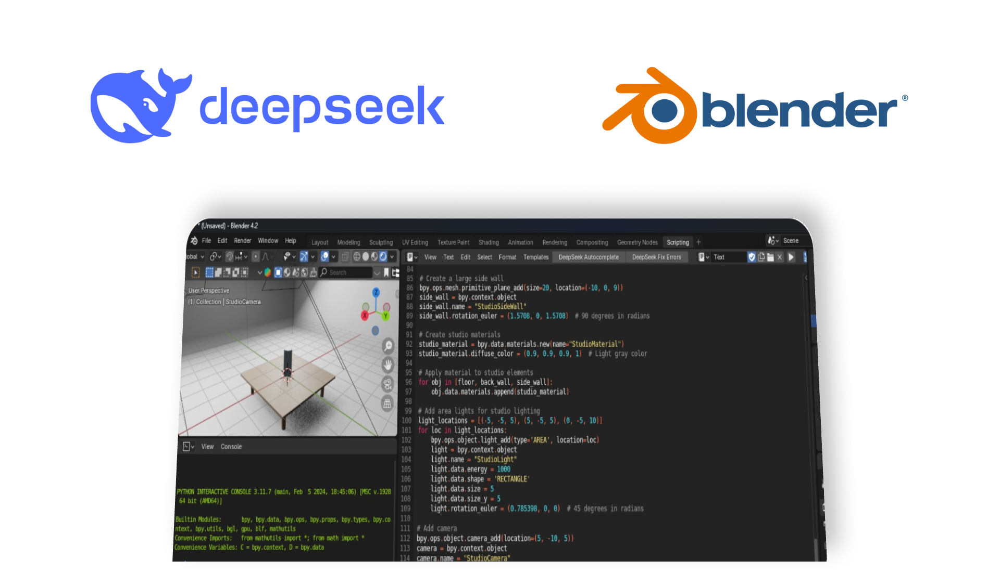

# AI DeepSeek Autocomplete for Blender (Experimental)

An experimental AI-powered code assistant for Blender's Text Editor, integrating with DeepSeek's API. Provides intelligent code completion and error fixing capabilities for Python scripting in Blender.

**⚠️ Disclaimer**: This is an unofficial experimental addon and not affiliated with DeepSeek. Use at your own risk.

## Features

- **AI Code Completion**: Context-aware code suggestions
- **Error Auto-Fix**: Automatic error analysis and correction
- **Customizable Prompts**: Adjustable prompt templates
- **API Configuration**: Full control over model parameters
- **Code Context Awareness**: Maintains existing code style

## Installation

1. Download `ai_deepseek_text_editor-1.0.0`
2. In Blender:
   - Edit > Preferences > Add-ons
   - Click "Install from disk" and select the downloaded zip file
   - Enable the addon in the list

## Configuration

1. In Blender Preferences > Add-ons:
2. Find "AI DeepSeek Autocomplete" and expand preferences:
   - **Required**: Enter your [DeepSeek API Key](https://platform.deepseek.com/api-keys)
   - Adjust parameters (defaults work for most users):
     - API URL
     - Model name
     - Temperature
     - Max tokens
     - Advanced prompt templates

## Usage

### Basic Workflow

1. Open Text Editor in Blender
2. Create comment block with `#` to provide context
3. Use shortcuts or buttons to interact with AI

### Shortcuts

| Function                | Shortcut     | Description                                  |
|-------------------------|--------------|----------------------------------------------|
| **AI Autocomplete**     | `Ctrl + Space` | Generate code continuation at cursor position|
| **Fix Errors**          | `F8`           | Analyze errors and attempt automatic fix    |

## Features Details

1. **Smart Autocomplete**:
   - Maintains code style
   - Context-aware suggestions
   - Inserts clean Python code

2. **Error Fixing**:
   - Automatic code execution
   - Error log analysis
   - Context-aware corrections
   - Preserves original code structure

3. **Customization**:
   - Adjust temperature for creativity/accuracy
   - Modify max response length
   - Create custom prompts
   - Fine-tune sampling parameters

## Important Notes

- **Experimental**: May occasionally produce invalid code
- **API Costs**: Uses your DeepSeek API credits
- **Code Safety**: Always review AI-generated code before execution
- **Error Handling**: Not all errors can be automatically fixed
- **Performance**: Depends on API response times

## Troubleshooting

1. **No API Key**:
   - Addon disabled until valid key is provided

2. **API Errors**:
   - Check console for detailed errors
   - Verify API endpoint URL

3. **Bad Suggestions**:
   - Reduce temperature parameter
   - Check prompt formatting
   - Ensure clear code context

## License

MIT License - Use responsibly. Not affiliated with DeepSeek or Blender.